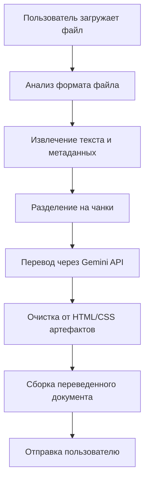

# 🤖 TransGemini Telegram Bot

**Интеллектуальный Telegram бот для перевода документов с использованием Google Gemini AI**

> Автоматический перевод файлов EPUB, DOCX, HTML, TXT и других форматов с сохранением структуры и форматирования

## 📋 Описание проекта

TransGemini Telegram Bot — это мощное решение для автоматического перевода документов различных форматов. Бот интегрирует Google Gemini AI для высококачественного перевода текста с сохранением исходной структуры документов.

### 🎯 Основные возможности

- **📚 Поддержка форматов:** EPUB, DOCX, HTML, TXT, FB2
- **🌍 Многоязычность:** Перевод на русский, английский и другие языки
- **🔧 Умная обработка:** Сохранение структуры, форматирования и метаданных
- **⚡ Асинхронная обработка:** Быстрая обработка больших файлов
- **🎨 Интерактивный интерфейс:** Удобное управление через Telegram
- **📊 Детальная аналитика:** Информация о прогрессе и статистике

## 🏗️ Архитектура проекта

```
translater_bot/
├── 📁 Core Components
│   ├── telegram_bot.py          # Основной Telegram бот
│   ├── TransGemini.py           # Движок перевода и обработки файлов
│   └── main_functions.py        # Вспомогательные функции
│
├── 📁 Configuration
│   ├── .env                     # Переменные окружения (токены, ключи)
│   ├── requirements.txt         # Python зависимости
│   └── .gitignore              # Исключения для Git
│
├── 📁 Scripts
│   ├── setup_venv.bat          # Автоматическая настройка окружения
│   ├── start_bot.bat           # Запуск бота
│   └── run_bot.py              # Точка входа
│
├── 📁 Development
│   ├── test_formats.py         # Тесты форматов файлов
│   ├── create_test_epub.py     # Создание тестовых EPUB
│   └── telegram_bot_backup.py  # Резервная копия
│
└── 📁 Environment
    └── venv/                   # Виртуальное окружение Python
```

## 🔧 Технический стек

### Backend
- **Python 3.8+** - Основной язык разработки
- **python-telegram-bot 20.7** - Telegram Bot API
- **google-generativeai 0.8.5** - Google Gemini AI интеграция

### Обработка документов
- **beautifulsoup4** - Парсинг HTML/XML
- **lxml** - Быстрый XML/HTML парсер
- **ebooklib** - Работа с EPUB файлами
- **python-docx** - Обработка DOCX документов
- **Pillow** - Работа с изображениями

### UI/UX
- **PyQt6** - Графический интерфейс (опционально)
- **Telegram Inline Keyboards** - Интерактивные кнопки

## ⚙️ Компоненты системы

### 1. 🤖 Telegram Bot (`telegram_bot.py`)
**Основной интерфейс взаимодействия с пользователями**

```python
# Ключевые функции:
- handle_document()      # Обработка загруженных файлов
- handle_settings()      # Управление настройками
- show_progress()        # Отображение прогресса
- extract_body_content_from_html()  # Очистка HTML от CSS
```

**Возможности:**
- Прием файлов до 20 МБ
- Выбор языка перевода
- Настройка параметров модели AI
- Отображение прогресса в реальном времени
- Автоматическая очистка от HTML/CSS артефактов

### 2. 🧠 TransGemini Engine (`TransGemini.py`)  
**Ядро системы перевода и обработки документов**

```python
# Основные классы:
- Worker                 # Многопоточная обработка файлов
- write_to_epub()       # Сборка переведенных EPUB
- write_to_html()       # Генерация HTML с правильной структурой
- write_to_fb2()        # Создание FB2 файлов
```

**Архитектурные особенности:**
- **Чанкинг:** Разделение больших документов на части
- **Многопоточность:** Параллельная обработка файлов
- **Восстановление:** Продолжение с места остановки
- **Валидация:** Проверка целостности переведенных файлов

### 3. 📄 Система обработки форматов

#### EPUB Processing
```python
# Workflow для EPUB:
1. Извлечение HTML файлов из архива
2. Парсинг метаданных (OPF, NAV, NCX)
3. Фильтрация контентных файлов
4. Перевод через Gemini API
5. Очистка от HTML артефактов
6. Сборка нового EPUB с сохранением структуры
```

#### DOCX Processing  
```python
# Workflow для DOCX:
1. Извлечение текста с сохранением стилей
2. Обработка таблиц и списков
3. Перевод контента
4. Восстановление форматирования
```

## 🔄 Workflow перевода



## 🌟 Ключевые особенности

### ✨ Умная обработка HTML
- **Проблема:** CSS стили попадали в тело документа
- **Решение:** Функция `extract_body_content_from_html()` 
  - Удаляет CSS стили из переведенного контента
  - Преобразует HTML в Markdown для TransGemini
  - Сохраняет структуру параграфов и заголовков

### 🔍 Продвинутая фильтрация файлов
```python
# Автоматическое исключение служебных файлов:
skip_indicators = ['toc', 'nav', 'cover', 'copyright', 'index']
```

### 📊 Система прогресса
- Реальное время отслеживания перевода
- Детальная информация о каждом этапе
- Обработка ошибок с уведомлениями

## 🔧 Конфигурация

### Environment Variables (`.env`)
```bash
TELEGRAM_BOT_TOKEN=your_telegram_token
GEMINI_API_KEY=your_gemini_api_key
DEFAULT_LANGUAGE=русский
MAX_FILE_SIZE=20971520  # 20MB
```

### Настройки модели Gemini
```python
MODELS = {
    "Gemini 2.0 Flash": {
        "model_name": "gemini-2.0-flash-exp",
        "max_tokens": 1000000,
        "temperature": 0.1
    }
}
```

## 📦 Установка и запуск

### Автоматическая установка (Windows)
```cmd
# 1. Клонируйте репозиторий
git clone https://github.com/BDaaac/g_translater.git
cd g_translater

# 2. Запустите автоматическую настройку
setup_venv.bat

# 3. Настройте .env файл с вашими токенами

# 4. Запустите бота
start_bot.bat
```

### Ручная установка
```bash
# 1. Создание виртуального окружения
python -m venv venv
source venv/bin/activate  # Linux/Mac
# или
venv\Scripts\activate     # Windows

# 2. Установка зависимостей
pip install -r requirements.txt

# 3. Запуск
python telegram_bot.py
```

## 🎮 Использование

### Команды бота
- `/start` - Запуск и приветствие
- `/help` - Справка по использованию
- `/settings` - Настройки перевода
- `/status` - Статус системы

### Процесс перевода
1. **Загрузите файл** в чат с ботом
2. **Выберите язык** перевода
3. **Настройте параметры** (опционально)
4. **Дождитесь результата** - бот покажет прогресс
5. **Скачайте** переведенный файл

## 🐛 Решение проблем

### Частые ошибки
- **Пустые EPUB файлы:** Исправлено очисткой HTML от CSS
- **Ошибки импорта:** Проверьте виртуальное окружение
- **Превышение лимитов API:** Настройте задержки между запросами

### Логирование
```python
# Детальные логи в консоли:
logging.basicConfig(level=logging.INFO)
```

## 🔮 Планы развития

- [ ] **PDF поддержка** с OCR
- [ ] **Пакетный перевод** нескольких файлов
- [ ] **Веб-интерфейс** как альтернатива Telegram
- [ ] **Дополнительные языки** и модели AI
- [ ] **Кэширование переводов** для ускорения

## 🤝 Вклад в проект

Приветствуются pull requests и предложения по улучшению!

## 📄 Лицензия

MIT License - свободное использование с указанием авторства

---

**🚀 Создано с использованием Google Gemini AI и любовью к автоматизации!**
5. Скопируйте ключ (он начинается с "AI...")

## 📋 Поддерживаемые форматы

### Входные форматы:
- **TXT** - текстовые файлы (.txt)
- **DOCX** - документы Microsoft Word (.docx)
- **HTML** - веб-страницы (.html, .htm)
- **EPUB** - электронные книги (.epub)
- **XML** - XML документы (.xml)

### Выходные форматы:
- **TXT** - простой текст
- **DOCX** - документ Word с форматированием
- **HTML** - веб-страница с базовым CSS

## 🎯 Как использовать

### Шаг 1: Запуск
Отправьте команду `/start` боту

### Шаг 2: Загрузка файла
Отправьте файл боту (максимум 20MB)

### Шаг 3: Выбор формата
Выберите желаемый выходной формат из предложенных

### Шаг 4: API ключ
Отправьте ваш API ключ Google Gemini

### Шаг 5: Настройки
- Выберите язык перевода (русский, английский, немецкий, французский, испанский)
- Нажмите "Начать перевод"

### Шаг 6: Получение результата
Дождитесь завершения перевода и скачайте переведенный файл

## 🛠 Команды бота

- `/start` - Начать работу с ботом
- `/help` - Показать справку
- `/cancel` - Отменить текущий процесс

## ⚙️ Технические детails

### Ограничения:
- Максимальный размер входного файла: 20MB (ограничение Telegram)
- Максимальный размер выходного файла: 50MB (ограничение Telegram)
- Скорость перевода зависит от размера файла и загруженности API

### Модели Gemini:
- **Gemini 2.0 Flash** (по умолчанию) - быстрая и эффективная
- **Gemini 1.5 Flash** - стабильная версия
- **Gemini 1.5 Pro** - максимальное качество

## 🔧 Настройка переменных окружения

Вы можете установить токен бота как переменную окружения:

### Windows:
```cmd
set TELEGRAM_BOT_TOKEN=your_bot_token_here
```

### Linux/Mac:
```bash
export TELEGRAM_BOT_TOKEN=your_bot_token_here
```

## 🐛 Устранение неполадок

### Ошибка "Import telegram could not be resolved"
```bash
pip install python-telegram-bot==20.7
```

### Ошибка "Import google.generativeai could not be resolved"
```bash
pip install google-generativeai
```

### Ошибка "Import docx could not be resolved"
```bash
pip install python-docx
```

### Бот не отвечает
1. Проверьте правильность токена бота
2. Убедитесь что бот запущен
3. Проверьте интернет соединение

### Ошибки перевода
1. Проверьте правильность API ключа Gemini
2. Убедитесь что у вас есть квота в Google AI Studio
3. Проверьте размер файла (не более 20MB)

## 📁 Структура проекта

```
translater_bot/
├── telegram_bot.py         # Основной файл бота
├── run_bot.py             # Установщик и запускальщик
├── setup_venv.bat         # Настройка виртуального окружения (Windows)
├── start_bot.bat          # Запуск бота с активированным venv
├── requirements.txt       # Зависимости Python
├── TransGemini.py         # Существующий код переводчика (не используется)
├── venv/                  # Виртуальное окружение (создается автоматически)
└── README.md             # Эта инструкция
```

## 🎉 Готово!

Ваш бот готов к работе! Отправьте ему файл и наслаждайтесь автоматическим переводом.

## 📞 Поддержка

При возникновении проблем:
1. Проверьте все зависимости установлены
2. Убедитесь что токен бота и API ключ корректны
3. Проверьте размер и формат файла
4. Перезапустите бота командой `/start`
