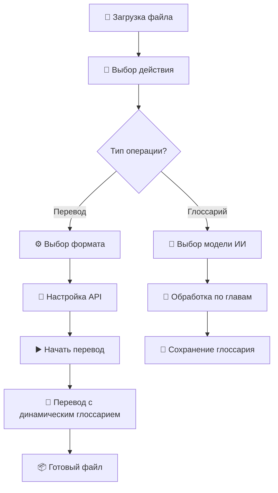
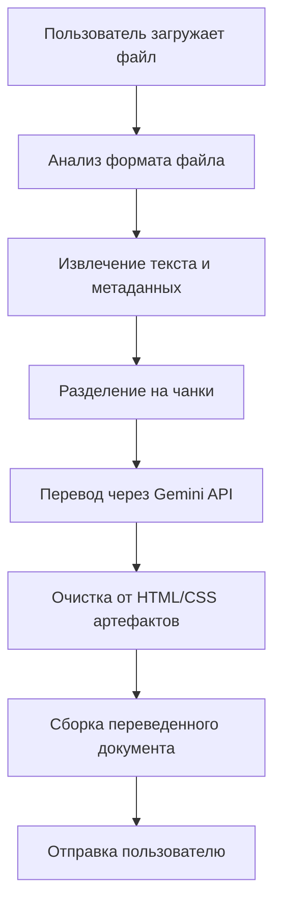

# 🤖 TransGemini Telegram Bot v2.0

**Интеллектуальный Telegram бот для перевода документов с революционной динамической фильтрацией глоссария**

> Автоматический перевод файлов EPUB, DOCX, HTML, TXT и других форматов с умной обработкой терминологии

[](https://python.org)
[](https://core.telegram.org/bots/api)
[](https://ai.google.dev/)

## 🚀 Новое в версии 2.0

### 🔥 **Динамическая фильтрация глоссария**
- **До**: 91 термин передавался в каждый чанк ❌
- **После**: 3-5 релевантных терминов на чанк ✅
- **Результат**: ⬇️ Токены, ⬆️ Точность, ⬆️ Скорость

### 📚 **Создание глоссария из файла**
- Автоматическое извлечение терминов
- Обработка по главам с выбором модели
- Сохранение в JSON для переиспользования

### ⚙️ **Расширенные настройки**
- Управление API ключами с ротацией
- Кастомные промпты для перевода
- Настройка температуры модели
- Поддержка прокси

---

## 📋 Описание проекта

TransGemini Telegram Bot — это передовое решение для автоматического перевода документов с использованием искусственного интеллекта Google Gemini. Уникальная система динамической фильтрации глоссария обеспечивает максимальную точность перевода терминологии.

### 🎯 Основные возможности

- **📚 Поддержка форматов:** EPUB, DOCX, HTML, TXT, FB2, XML
- **🧠 ИИ перевод:** Google Gemini 2.0 Flash, 1.5 Pro и другие модели
- **� Умный глоссарий:** Динамическая фильтрация терминов по контексту
- **🔄 Ротация ключей:** Автоматическое переключение API ключей
- **⚡ Чанкинг:** Обработка файлов любого размера
- **🎨 Интерактивный UI:** Полное управление через Telegram
- **📊 Детальная аналитика:** Мониторинг процесса в реальном времени

---

## 🏗️ Архитектура системы

```
translater_bot/
├── 🤖 Core Bot
│   ├── telegram_bot.py          # Основной бот (4352 строки)
│   ├── UserState                # Управление состоянием пользователей
│   └── DynamicWorker            # Расширенный Worker с глоссарием
│
├── 🧠 Translation Engine  
│   ├── TransGemini.py           # Движок перевода и обработки
│   ├── Worker.py                # Базовый класс обработки
│   └── DynamicGlossaryFilter    # Фильтрация терминов
│
├── ⚙️ Configuration
│   ├── .env                     # Переменные окружения
│   ├── requirements.txt         # Зависимости
│   └── glossary.json           # Пример глоссария
│
└── 📚 Documentation
    ├── README.md               # Это руководство
    └── АРХИТЕКТУРА.md          # Техническая документация
```

---

## 🔧 Технический стек

### 🖥️ Backend
- **Python 3.8+** - Основной язык
- **python-telegram-bot 20.7** - Telegram API
- **google-generativeai** - Google Gemini AI
- **asyncio** - Асинхронная обработка

### 📄 Обработка документов
- **beautifulsoup4 + lxml** - HTML/XML парсинг
- **ebooklib** - EPUB файлы
- **python-docx** - DOCX документы
- **Pillow** - Изображения

### 🎯 ИИ и обработка данных
- **regex** - Продвинутый поиск терминов
- **json** - Управление глоссариями
- **tempfile** - Безопасная работа с файлами

---

## 🚀 Быстрый старт

### � Автоматическая установка
```bash
# 1. Клонирование репозитория
git clone https://github.com/BDaaac/g_translater.git
cd g_translater

# 2. Установка зависимостей
pip install -r requirements.txt

# 3. Настройка .env файла
echo "TELEGRAM_BOT_TOKEN=your_bot_token" > .env

# 4. Запуск бота
python telegram_bot.py
```

### ⚙️ Настройка переменных окружения
```bash
# .env файл
TELEGRAM_BOT_TOKEN=your_telegram_bot_token
GEMINI_API_KEY=your_gemini_api_key_optional
```

### 🤖 Получение токенов

#### Telegram Bot Token:
1. Напишите [@BotFather](https://t.me/BotFather) в Telegram
2. Отправьте `/newbot`
3. Следуйте инструкциям
4. Получите токен

#### Google Gemini API Key:
1. Перейдите в [Google AI Studio](https://makersuite.google.com/app/apikey)
2. Создайте новый API ключ
3. Скопируйте ключ (начинается с "AI...")

---

## 🎮 Использование бота

### 📱 Основные команды
```
/start    - Запуск бота и приветствие
/help     - Справка по использованию  
/cancel   - Отмена текущей операции
/settings - Панель настроек
```

### 🔑 Управление API ключами
```
/addkey <ключ>      - Добавить API ключ
/removekey <номер>  - Удалить ключ  
/clearkeys          - Очистить все ключи
/rotation on/off    - Включить/выключить ротацию
/apikeys            - Показать текущие ключи
```

### 🎯 Процесс перевода


---

## 🌟 Уникальные возможности

### 🔥 **Динамическая фильтрация глоссария**

**Проблема**: При обычном подходе все термины глоссария отправляются с каждым чанком текста, что приводит к излишнему расходу токенов и снижению качества.

**Решение**: Наша система анализирует каждый чанк и отбирает только релевантные термины:

```python
# Пример работы фильтрации:
Исходный глоссарий: 91 термин
Текст чанка: "Harry walked to Hogwarts castle..."
Отфильтрованный глоссарий: 3 термина
├── Harry → Гарри  
├── Hogwarts → Хогвартс
└── castle → замок

Экономия токенов: 88 терминов × 20 чанков = 1760 терминов
```

### 📚 **Создание глоссария из файла**

Бот может автоматически создать глоссарий из вашего файла:

1. **Выберите действие**: "Создать глоссарий"
2. **Загрузите файл**: EPUB, DOCX, TXT и др.
3. **Выберите модель**: Gemini 2.0 Flash для лучшего качества
4. **Автоматическая обработка**: По главам с извлечением терминов
5. **Получите JSON**: Готовый глоссарий для переиспользования

### ⚙️ **Панель настроек (/settings)**

Полный контроль над процессом перевода:

```
⚙️ Настройки перевода
├── 🔑 API ключи (управление ключами)
├── 🧠 Модель перевода (выбор Gemini модели) 
├── 🌡️ Температура (креативность ИИ)
├── 📝 Промпт (кастомные инструкции)
├── 🔄 Ротация ключей (автопереключение)
├── 🔍 Глоссарий (управление терминологией)
└── 🌐 Прокси (настройка сети)
```

---

## 📁 Поддерживаемые форматы

### 📥 Входные форматы
| Формат | Расширения | Особенности |
|--------|------------|-------------|
| **EPUB** | `.epub` | Полная поддержка структуры, метаданных |
| **DOCX** | `.docx` | Сохранение форматирования, таблиц |
| **HTML** | `.html`, `.htm` | Очистка от CSS, сохранение разметки |
| **TXT** | `.txt` | Простой текст |
| **XML** | `.xml` | Структурированные данные |
| **FB2** | `.fb2` | Электронные книги |

### 📤 Выходные форматы  
| Формат | Возможности |
|--------|-------------|
| **EPUB** | Сборка с оригинальной структурой |
| **DOCX** | Восстановление форматирования |
| **HTML** | Чистый HTML с базовым CSS |
| **TXT** | Простой переведенный текст |

---

## 🎛️ Продвинутые функции

### � **Ротация API ключей**
```python
# Автоматическое переключение при лимитах
api_keys = ["key1", "key2", "key3"]
rotation_enabled = True

# При ошибке 429 (Rate Limit):
current_key = switch_to_next_key()
continue_translation()
```

### 🎯 **Умное чанкинг**
```python
# Оптимальное разделение текста
chunk_limit = 900_000  # символов
chunk_window = 500     # символов перекрытия
delay_between_chunks = 0.5  # секунд
```

### 📊 **Мониторинг процесса**
```
🚀 translate_file_with_transgemini: Начинаем перевод
📁 Входной файл: book.epub  
📄 Формат: epub -> epub
📚 Глоссарий передан: Да
📚 Размер глоссария: 91 терминов
🔧 DynamicWorker создан
🔍 Динамическая фильтрация: 91 → 3 терминов для чанка
📚 Применен динамический глоссарий: 3 терминов
✅ Перевод завершен успешно
```

---

## 🛠️ Разработка и кастомизация

### 🔧 **Структура классов**

```python
# Основные компоненты
class UserState:           # Состояние пользователя
class DynamicWorker:       # Расширенный Worker
class DynamicGlossaryFilterBot:  # Фильтрация терминов

# Ключевые функции  
async def translate_file_with_transgemini()  # Основная функция перевода
def format_glossary_for_prompt()            # Форматирование глоссария
def filter_glossary_for_text()              # Фильтрация по тексту
```

### 🎨 **Кастомизация промптов**

Через `/settings` → `📝 Промпт` можно настроить:
- Стиль перевода
- Специфические инструкции
- Обработка терминологии
- Сохранение форматирования

### 🔍 **Отладка**

```python
# Включение детального логирования
logging.basicConfig(level=logging.INFO)

# Ключевые лог-сообщения:
# 📚 - глоссарий
# 🔍 - фильтрация  
# 🤖 - модель ИИ
# ⚙️ - настройки
# ✅/❌ - результаты
```

---

## 🐛 Устранение неполадок

### ❌ **Частые ошибки**

| Ошибка | Причина | Решение |
|--------|---------|---------|
| `NoneType path error` | Не скачался файл | Проверить размер файла (<20MB) |
| `API Rate Limit` | Превышен лимит запросов | Включить ротацию ключей |
| `Empty response` | Проблема с моделью | Сменить модель через `/settings` |
| `Format not supported` | Неподдерживаемый формат | Проверить список форматов |

### 🔧 **Диагностика**

```bash
# Проверка зависимостей
pip list | grep -E "(telegram|google|beautifulsoup|docx|ebooklib)"

# Тест API ключа
python -c "import google.generativeai as genai; genai.configure(api_key='YOUR_KEY')"

# Проверка бота
curl -X GET "https://api.telegram.org/bot<TOKEN>/getMe"
```

### 📊 **Мониторинг производительности**

```python
# Метрики для отслеживания:
- translation_time        # Время перевода
- glossary_filter_ratio   # Эффективность фильтрации  
- chunk_processing_speed  # Скорость обработки чанков
- api_success_rate       # Успешность API запросов
```

---

## 🔮 Планы развития

### � **Версия 2.1**
- [ ] **PDF поддержка** с OCR распознаванием
- [ ] **Пакетный перевод** нескольких файлов
- [ ] **Веб-интерфейс** как альтернатива Telegram
- [ ] **Кэширование переводов** для ускорения

### 🏗️ **Версия 3.0**  
- [ ] **База данных** для состояний пользователей
- [ ] **Многопользовательские глоссарии**
- [ ] **API для интеграции** с другими сервисами
- [ ] **Продвинутая аналитика** использования

### 🌍 **Долгосрочные планы**
- [ ] **Поддержка Claude, GPT-4** и других моделей
- [ ] **Специализированные модели** для разных доменов
- [ ] **Коллаборативное редактирование** глоссариев
- [ ] **Мобильное приложение**

---

## 🏆 Преимущества

### ⚡ **Производительность**
- **До 85% экономии токенов** благодаря динамической фильтрации
- **Параллельная обработка** чанков для больших файлов  
- **Умное кэширование** состояний пользователей
- **Оптимизированные промпты** для каждого формата

### 🎯 **Качество перевода**
- **Контекстуальная терминология** через глоссарии
- **Сохранение структуры** документов
- **Очистка от артефактов** HTML/CSS
- **Специализированные промпты** для разных типов контента

### 🛡️ **Надежность**  
- **Обработка ошибок** с fallback механизмами
- **Ротация API ключей** для избежания лимитов
- **Детальное логирование** для отладки
- **Автоматическое восстановление** после сбоев

---

## 🤝 Вклад в проект

Мы приветствуем вклад сообщества! 

### 🔧 **Как помочь проекту:**
1. **Fork** репозитория
2. **Создайте feature branch** (`git checkout -b feature/amazing-feature`)
3. **Commit** изменения (`git commit -m 'Add amazing feature'`)
4. **Push** в branch (`git push origin feature/amazing-feature`)  
5. **Создайте Pull Request**

### � **Сообщения об ошибках**
- Используйте GitHub Issues
- Приложите логи и скриншоты
- Укажите версию Python и OS
- Опишите шаги воспроизведения

---

## 📄 Лицензия

**MIT License** - свободное использование с указанием авторства

---

## 📞 Поддержка

### 💬 **Контакты**
- **GitHub Issues**: [github.com/BDaaac/g_translater](https://github.com/BDaaac/g_translater)
- **Telegram**: Создайте issue с тегом `question`
- **Email**: Указан в профиле GitHub

### 📚 **Документация**
- **README.md** - Основное руководство (этот файл)
- **АРХИТЕКТУРА.md** - Техническая документация
- **Code Comments** - Подробные комментарии в коде

---

**🚀 Создано с использованием Google Gemini AI, современных технологий и любовью к автоматизации!**

*Последнее обновление: Август 2025 | Версия: 2.0*
- **Python 3.8+** - Основной язык разработки
- **python-telegram-bot 20.7** - Telegram Bot API
- **google-generativeai 0.8.5** - Google Gemini AI интеграция

### Обработка документов
- **beautifulsoup4** - Парсинг HTML/XML
- **lxml** - Быстрый XML/HTML парсер
- **ebooklib** - Работа с EPUB файлами
- **python-docx** - Обработка DOCX документов
- **Pillow** - Работа с изображениями

### UI/UX
- **PyQt6** - Графический интерфейс (опционально)
- **Telegram Inline Keyboards** - Интерактивные кнопки

## ⚙️ Компоненты системы

### 1. 🤖 Telegram Bot (`telegram_bot.py`)
**Основной интерфейс взаимодействия с пользователями**

```python
# Ключевые функции:
- handle_document()      # Обработка загруженных файлов
- handle_settings()      # Управление настройками
- show_progress()        # Отображение прогресса
- extract_body_content_from_html()  # Очистка HTML от CSS
```

**Возможности:**
- Прием файлов до 20 МБ
- Выбор языка перевода
- Настройка параметров модели AI
- Отображение прогресса в реальном времени
- Автоматическая очистка от HTML/CSS артефактов

### 2. 🧠 TransGemini Engine (`TransGemini.py`)  
**Ядро системы перевода и обработки документов**

```python
# Основные классы:
- Worker                 # Многопоточная обработка файлов
- write_to_epub()       # Сборка переведенных EPUB
- write_to_html()       # Генерация HTML с правильной структурой
- write_to_fb2()        # Создание FB2 файлов
```

**Архитектурные особенности:**
- **Чанкинг:** Разделение больших документов на части
- **Многопоточность:** Параллельная обработка файлов
- **Восстановление:** Продолжение с места остановки
- **Валидация:** Проверка целостности переведенных файлов

### 3. 📄 Система обработки форматов

#### EPUB Processing
```python
# Workflow для EPUB:
1. Извлечение HTML файлов из архива
2. Парсинг метаданных (OPF, NAV, NCX)
3. Фильтрация контентных файлов
4. Перевод через Gemini API
5. Очистка от HTML артефактов
6. Сборка нового EPUB с сохранением структуры
```

#### DOCX Processing  
```python
# Workflow для DOCX:
1. Извлечение текста с сохранением стилей
2. Обработка таблиц и списков
3. Перевод контента
4. Восстановление форматирования
```

## 🔄 Workflow перевода



## 🌟 Ключевые особенности

### ✨ Умная обработка HTML
- **Проблема:** CSS стили попадали в тело документа
- **Решение:** Функция `extract_body_content_from_html()` 
  - Удаляет CSS стили из переведенного контента
  - Преобразует HTML в Markdown для TransGemini
  - Сохраняет структуру параграфов и заголовков

### 🔍 Продвинутая фильтрация файлов
```python
# Автоматическое исключение служебных файлов:
skip_indicators = ['toc', 'nav', 'cover', 'copyright', 'index']
```

### 📊 Система прогресса
- Реальное время отслеживания перевода
- Детальная информация о каждом этапе
- Обработка ошибок с уведомлениями

## 🔧 Конфигурация

### Environment Variables (`.env`)
```bash
TELEGRAM_BOT_TOKEN=your_telegram_token
GEMINI_API_KEY=your_gemini_api_key
DEFAULT_LANGUAGE=русский
MAX_FILE_SIZE=20971520  # 20MB
```

### Настройки модели Gemini
```python
MODELS = {
    "Gemini 2.0 Flash": {
        "model_name": "gemini-2.0-flash-exp",
        "max_tokens": 1000000,
        "temperature": 0.1
    }
}
```

## 📦 Установка и запуск

### Автоматическая установка (Windows)
```cmd
# 1. Клонируйте репозиторий
git clone https://github.com/BDaaac/g_translater.git
cd g_translater

# 2. Запустите автоматическую настройку
setup_venv.bat

# 3. Настройте .env файл с вашими токенами

# 4. Запустите бота
start_bot.bat
```

### Ручная установка
```bash
# 1. Создание виртуального окружения
python -m venv venv
source venv/bin/activate  # Linux/Mac
# или
venv\Scripts\activate     # Windows

# 2. Установка зависимостей
pip install -r requirements.txt

# 3. Запуск
python telegram_bot.py
```

## 🎮 Использование

### Команды бота
- `/start` - Запуск и приветствие
- `/help` - Справка по использованию
- `/settings` - Настройки перевода
- `/status` - Статус системы

### Процесс перевода
1. **Загрузите файл** в чат с ботом
2. **Выберите язык** перевода
3. **Настройте параметры** (опционально)
4. **Дождитесь результата** - бот покажет прогресс
5. **Скачайте** переведенный файл

## 🐛 Решение проблем

### Частые ошибки
- **Пустые EPUB файлы:** Исправлено очисткой HTML от CSS
- **Ошибки импорта:** Проверьте виртуальное окружение
- **Превышение лимитов API:** Настройте задержки между запросами

### Логирование
```python
# Детальные логи в консоли:
logging.basicConfig(level=logging.INFO)
```

## 🔮 Планы развития

- [ ] **PDF поддержка** с OCR
- [ ] **Пакетный перевод** нескольких файлов
- [ ] **Веб-интерфейс** как альтернатива Telegram
- [ ] **Дополнительные языки** и модели AI
- [ ] **Кэширование переводов** для ускорения

## 🤝 Вклад в проект

Приветствуются pull requests и предложения по улучшению!

## 📄 Лицензия

MIT License - свободное использование с указанием авторства

---

**🚀 Создано с использованием Google Gemini AI и любовью к автоматизации!**
5. Скопируйте ключ (он начинается с "AI...")

## 📋 Поддерживаемые форматы

### Входные форматы:
- **TXT** - текстовые файлы (.txt)
- **DOCX** - документы Microsoft Word (.docx)
- **HTML** - веб-страницы (.html, .htm)
- **EPUB** - электронные книги (.epub)
- **XML** - XML документы (.xml)

### Выходные форматы:
- **TXT** - простой текст
- **DOCX** - документ Word с форматированием
- **HTML** - веб-страница с базовым CSS

## 🎯 Как использовать

### Шаг 1: Запуск
Отправьте команду `/start` боту

### Шаг 2: Загрузка файла
Отправьте файл боту (максимум 20MB)

### Шаг 3: Выбор формата
Выберите желаемый выходной формат из предложенных

### Шаг 4: API ключ
Отправьте ваш API ключ Google Gemini

### Шаг 5: Настройки
- Выберите язык перевода (русский, английский, немецкий, французский, испанский)
- Нажмите "Начать перевод"

### Шаг 6: Получение результата
Дождитесь завершения перевода и скачайте переведенный файл

## 🛠 Команды бота

- `/start` - Начать работу с ботом
- `/help` - Показать справку
- `/cancel` - Отменить текущий процесс

## ⚙️ Технические детails

### Ограничения:
- Максимальный размер входного файла: 20MB (ограничение Telegram)
- Максимальный размер выходного файла: 50MB (ограничение Telegram)
- Скорость перевода зависит от размера файла и загруженности API

### Модели Gemini:
- **Gemini 2.0 Flash** (по умолчанию) - быстрая и эффективная
- **Gemini 1.5 Flash** - стабильная версия
- **Gemini 1.5 Pro** - максимальное качество

## 🔧 Настройка переменных окружения

Вы можете установить токен бота как переменную окружения:

### Windows:
```cmd
set TELEGRAM_BOT_TOKEN=your_bot_token_here
```

### Linux/Mac:
```bash
export TELEGRAM_BOT_TOKEN=your_bot_token_here
```

## 🐛 Устранение неполадок

### Ошибка "Import telegram could not be resolved"
```bash
pip install python-telegram-bot==20.7
```

### Ошибка "Import google.generativeai could not be resolved"
```bash
pip install google-generativeai
```

### Ошибка "Import docx could not be resolved"
```bash
pip install python-docx
```

### Бот не отвечает
1. Проверьте правильность токена бота
2. Убедитесь что бот запущен
3. Проверьте интернет соединение

### Ошибки перевода
1. Проверьте правильность API ключа Gemini
2. Убедитесь что у вас есть квота в Google AI Studio
3. Проверьте размер файла (не более 20MB)

## 📁 Структура проекта

```
translater_bot/
├── telegram_bot.py         # Основной файл бота
├── run_bot.py             # Установщик и запускальщик
├── setup_venv.bat         # Настройка виртуального окружения (Windows)
├── start_bot.bat          # Запуск бота с активированным venv
├── requirements.txt       # Зависимости Python
├── TransGemini.py         # Существующий код переводчика (не используется)
├── venv/                  # Виртуальное окружение (создается автоматически)
└── README.md             # Эта инструкция
```

## 🎉 Готово!

Ваш бот готов к работе! Отправьте ему файл и наслаждайтесь автоматическим переводом.

## 📞 Поддержка

При возникновении проблем:
1. Проверьте все зависимости установлены
2. Убедитесь что токен бота и API ключ корректны
3. Проверьте размер и формат файла
4. Перезапустите бота командой `/start`
